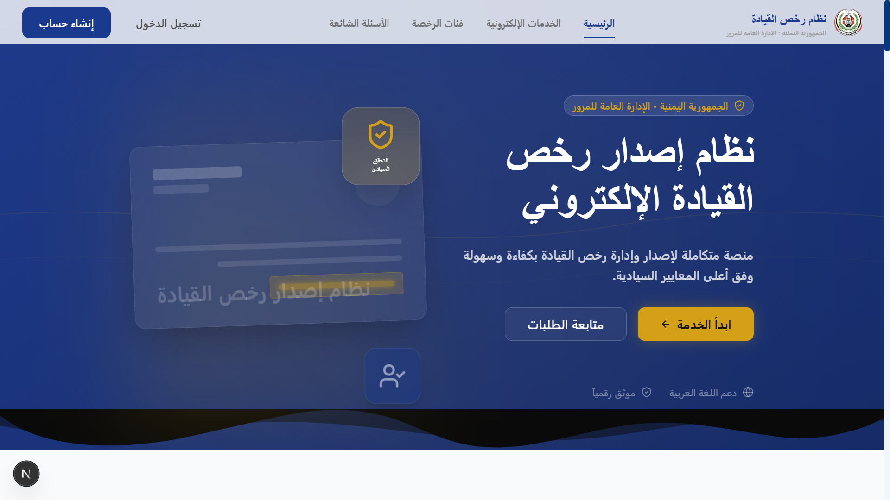
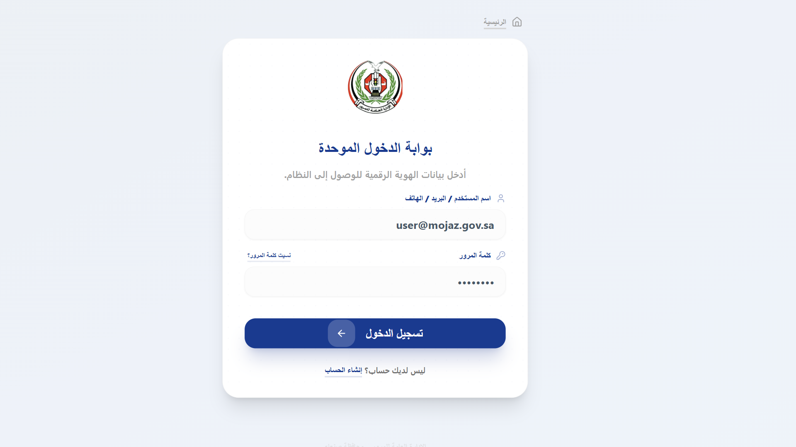
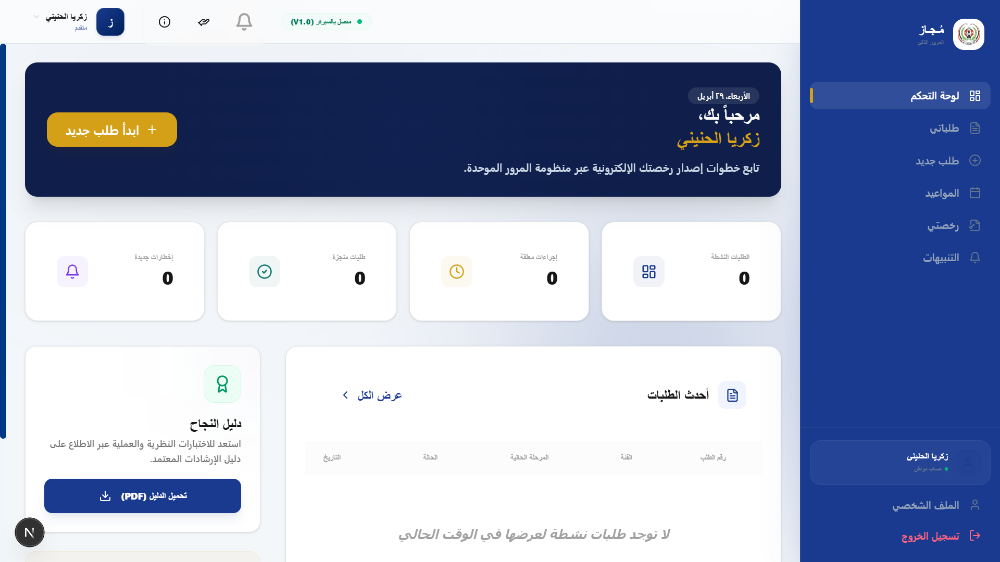
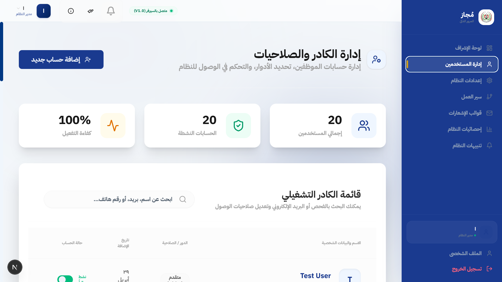

# مُجاز — Mojaz Platform
### Government Driving License Management System | منصة إدارة رخص القيادة الحكومية

<p align="center">
  
</p>

---

<div align="center">


---

> **مُجاز** (*Mojaz*) — تعني "المرخّص" | Arabic for *"Licensed"*
>
> منصة حكومية رقمية شاملة لإدارة دورة حياة رخصة القيادة بالكامل — من التقديم للإصدار — بشكل كامل عبر الإنترنت.

[🇸🇦 العربية](#overview) · [🇬🇧 English](#overview)

</div>

---

## 📑 فهرس المحتويات | Table of Contents

- [النظرة العامة | Overview](#overview)
- [معاينة المنصة | Screenshots](#screenshots)
- [الأرقام الرئيسية | Key Numbers](#key-numbers)
- [المميزات | Features](#features)
- [التقنيات | Tech Stack](#tech-stack)
- [البنية المعمارية | Architecture](#architecture)
- [الخدمات | Services](#services)
- [فئات الرخص | License Categories](#license-categories)
- [أدوار المستخدمين | User Roles](#user-roles)
- [سير العمل | Workflow](#workflow)
- [البدء السريع | Quick Start](#quick-start)
- [قاعدة البيانات | Database](#database)
- [الاختبارات | Testing](#testing)
- [النشر | Deployment](#deployment)
- [المساهمة | Contributing](#contributing)
- [الترخيص | License](#license)

---

## 🎯 Overview | النظرة العامة

Mojaz is a **production-grade government digital platform** that digitizes the complete driving license lifecycle in Saudi Arabia. Inspired by the Absher Design System, it provides a modern, official government experience with full **Arabic RTL** and **English LTR** support.

### Problem → Solution

| المشكلة | الحل |
|---------|------|
| طلبات ورقية يدوية | عملية رقمية بالكامل |
| زيارات متعددة للمقر | زيارة واحدة للاختبارات فقط |
| لا توجد تحديثات فورية | تتبع مباشر مع إشعارات فورية |
| تنفيذ قواعد غير متسق | محرك قواعد آلي |
| محدودية ساعات العمل | متاح 24/7 |
| لا يوجد سجل تدقيق | تاريخ كامل للعمليات |

---

## 📸 Screenshots | معاينة المنصة

<div align="center">

| الصفحة الرئيسية | تسجيل الدخول |
|:---:|:---:|
|  |  |

| لوحة المتقدم | لوحة المدير |
|:---:|:---:|
|  |  |

</div>

---

## 📊 Key Numbers | الأرقام الرئيسية

<div align="center">

| المعيار | العدد |
|--------|------|
| 👥 أدوار المستخدمين | **7** |
| 🛠️ خدمات MVP | **8** |
| 🪪 فئات الرخصة | **6** |
| 🔄 مراحل العمل | **10** |
| 🗄️ جداول قاعدة البيانات | **21** |
| 🌐 نقاط النهاية API | **~52** |
| 🖥️ شاشات UI | **21** |
| 📊 التقارير | **7** |
| 🧪 الاختبارات | **500+** |

</div>

---

## ✨ Features | المميزات

### للمتقدمين والمواطنين
- ✅ **تطبيقات إلكترونية** — معالج من 5 خطوات لإصدار رخصة جديدة
- ✅ **رفع المستندات** — تقديم رقمي لجميع المستندات المطلوبة
- ✅ **حجز المواعيد** — جدولة الفحوصات الطبية والاختبارات
- ✅ **الدفع الإلكتروني** — دفع متعدد النقاط مع إيصالات
- ✅ **تتبع الوقت الفعلي** — خط زمني مباشر لـ 10 مراحل
- ✅ **رخصة رقمية** — تحميل الرخصة كـ PDF احترافي
- ✅ **دعم ثنائي اللغة** — العربية (RTL) والإنجليزية (LTR)
- ✅ **الوضع الداكن/الفاتح** — اختيار المستخدم
- ✅ **إشعارات حقيقية** — SMS + Email + Push

### للموظفين الحكوميين
- ✅ **وصول مبني على الأدوار** — 7 أدوار متخصصة
- ✅ **قائمة انتظار العمل** — قوائم عمل حسب الدور
- ✅ **مراجعة المستندات** — التحقق جنباً إلى جنب
- ✅ **تسجيل النتائج** — طبية ونظرية وعملية

### للمديرين والإداريين
- ✅ **7 تقارير تشغيلية** — مع رسوم بيانية وتصدير
- ✅ **لوحة KPI** — مقاييس الأداء الفورية
- ✅ **إدارة الرسوم** — جدول رسوم ديناميكي
- ✅ **إعدادات النظام** — قواعد عمل قابلة للتكوين

---

## 🛠️ Tech Stack | التقنيات

### Backend | الخلفي

| التقنية | الاستخدام |
|---------|----------|
| **ASP.NET Core 8.0** | إطار عمل الويب |
| **Clean Architecture** | نمط 5 طبقات |
| **Entity Framework Core 8** | ORM |
| **SQL Server 2022** | قاعدة البيانات |
| **JWT + Refresh Token** | المصادقة |
| **FluentValidation** | التحقق |
| **AutoMapper** | تحويل الكائنات |
| **Hangfire** |_jobs الخلفية |
| **Serilog** | تسجيل منظم |
| **QuestPDF** | توليد PDF |
| **SendGrid** | البريد الإلكتروني |
| **Twilio** | الرسائل النصية |
| **Firebase Admin** | الإشعارات |
| **xUnit + Moq** | الاختبارات |

### Frontend | الواجهة

| التقنية | الاستخدام |
|---------|----------|
| **Next.js 15** | إطار العمل (App Router) |
| **TypeScript 5** | أمان الأنواع |
| **Tailwind CSS 4** | التنسيق |
| **shadcn/ui** | مكتبة المكونات |
| **React Query 5** | حالة الخادم |
| **Zustand 5** | حالة العميل |
| **Zod** | التحقق من المخطط |
| **next-intl** | الدولية |
| **next-themes** | الوضع الداكن |
| **Recharts** | التصور البياني |
| **TanStack Table** | الجداول المتقدمة |
| **Lucide React** | الأيقونات |
| **Playwright** | اختبارات E2E |

---

## 🏗️ Architecture | البنية المعمارية

```
┌─────────────────────────────────────────────────────┐
│                    Mojaz.API                        │
│         Controllers · Middleware · Program          │
├─────────────────────────────────────────────────────┤
│                  Mojaz.Infrastructure               │
│   EF Core · Repositories · External Services        │
│      SendGrid · Twilio · Firebase · Hangfire        │
├─────────────────────────────────────────────────────┤
│                   Mojaz.Application                 │
│            Services · DTOs · Validators             │
├─────────────────────┬───────────────────────────────┤
│     Mojaz.Domain    │        Mojaz.Shared           │
│   Entities · Enums  │   ApiResponse<T> · PagedResult │
└─────────────────────┴───────────────────────────────┘
```

---

## 🛠️ Services | الخدمات

| # | الخدمة | الوصف |
|---|--------|-------|
| 01 | إصدار رخصة جديدة | سير عمل كامل من 10 مراحل |
| 02 | تجديد الرخصة | تجديد للرخص المنتهية أو المنتهية الصلاحية |
| 03 | بدل فاقد/تالف | استبدال الرخصة المفقودة أو التالفة |
| 04 | ترقية الفئة | الانتقال من فئة لأخرى أعلى |
| 05 | إعادة الاختبار | إعادة التفعيل بعد الرسوب في الاختبار |
| 06 | حجز المواعيد | حجز مواعيد الفحوصات والاختبارات |
| 07 | إلغاء الطلب | إلغاء الطلب قبل الاكتمال |
| 08 | تحميل المستندات | تحميل الإيصالات والنتائج والرخصة PDF |

---

## 🪪 License Categories | فئات الرخص

| الفئة | الوصف | العربية | العمر الأدنى | الصلاحية |
|-------|-------|---------|-------------|----------|
| **A** | دراجة نارية | دراجة نارية | 16 سنة | 10 سنوات |
| **B** | سيارة خاصة | سيارة خاصة | 18 سنة | 10 سنوات |
| **C** | تجاري/أجرة | تجاري/أجرة | 21 سنة | 5 سنوات |
| **D** | حافلة/نقل ركاب | حافلة/نقل ركاب | 21 سنة | 5 سنوات |
| **E** | مركبات ثقيلة | مركبات ثقيلة | 21 سنة | 5 سنوات |
| **F** | مركبات زراعية | مركبات زراعية | 18 سنة | 10 سنوات |

---

## 👥 User Roles | أدوار المستخدمين

| الدور | العربية | الوظيفة الرئيسية |
|-------|---------|-----------------|
| **Applicant** | المتقدم | تقديم الطلبات، تتبع الحالة، دفع الرسوم |
| **Receptionist** | موظف الاستقبال | مراجعة الطلبات، التحقق من المستندات |
| **Doctor** | الطبيب | إجراء الفحوصات الطبية، تسجيل النتائج |
| **Examiner** | الفاحص | إجراء الاختبارات، تسجيل النتائج |
| **Manager** | المدير | الإشراف، الاستثناءات، التقارير |
| **Security** | الجهة الأمنية | التحقق الامني |
| **Admin** | مسؤول النظام | إعداد النظام، إدارة المستخدمين |

---

## 🔄 Workflow | سير العمل

```
01. إنشاء الطلب
       │
       ▼ ⛩️ بوابة 1: فحص العمر، لا طلب نشط، لا عوائق
02. رفع المستندات ومراجعتها
       │
       ▼
03. الدفع الأولي (رسوم التقديم)
       ▼ ⛩️ بوابة 2: الدفع مؤكدة، البيانات كاملة
04. الفحص الطبي
       │
       ▼
05. تدريب القيادة
       ▼ ⛩️ بوابة 3: طبيعة طبية، تدريب مكتمل
06. الاختبار النظري
       │
       ▼
07. الاختبار العملي
       │
       ▼ ⛩️ بوابة 4: جميع الاختبارات اجتازت
08. الموافقة النهائية
       │
       ▼
09. إصدار الرخصة والدفع
       │
       ▼
10. إصدار الرخصة ← PDF Generated
```

---

## 🚀 Quick Start | البدء السريع

### المتطلبات | Prerequisites

```bash
#必需的 | Requirements
- .NET SDK 8.0+
- Node.js 20 LTS+
- Docker Desktop
- Git
```

### التثبيت | Installation

```bash
# Clone
git clone https://github.com/ZakariaAl-honyny/Mojaz.git
cd mojaz

# Backend
cd src/backend
dotnet restore
dotnet ef database update --project Mojaz.Infrastructure --startup-project Mojaz.API
cd Mojaz.API && dotnet run

# Frontend
cd src/frontend
npm install
npm run dev
```

### الوصول | Access

| البوابة | الرابط | البيانات الافتراضية |
|---------|--------|-------------------|
| الصفحة الرئيسية | http://localhost:3000 | — |
| بوابة المتقدم | http://localhost:3000/ar/dashboard | applicant@test.com / Test@1234 |
| بوابة الموظف | http://localhost:3000/ar/employee | receptionist@mojaz.gov.sa / Test@1234 |
| بوابة المدير | http://localhost:3000/ar/admin | admin@mojaz.gov.sa / Admin@Mojaz2025 |
| API | https://localhost:7127/api/v1 | — |
| Swagger | https://localhost:7127/swagger | — |

---

## 🗄️ Database | قاعدة البيانات

### الجداول | Tables (21)

- **Core**: Users, Applicants, Applications, LicenseCategories, Licenses
- **Workflow**: Documents, Appointments, MedicalExams, TrainingRecords, TheoryTests, PracticalTests
- **Financial**: Payments, FeeStructures
- **Notifications**: Notifications, PushTokens
- **Configuration**: SystemSettings
- **Security**: AuditLogs, OtpCodes, RefreshTokens
- **Logging**: EmailLogs, SmsLogs

---

## 🧪 Testing | الاختبارات

```bash
# Backend
cd src/backend
dotnet test

# Frontend
cd src/frontend
npm test

# E2E
npm run test:e2e
```

---

## 🚢 Deployment | النشر

```bash
# Docker Compose
docker-compose up -d

# Production
docker build -t mojaz-api:latest -f src/backend/Mojaz.API/Dockerfile .
docker-compose -f docker-compose.prod.yml up -d
```

---

## 🤝 Contributing | المساهمة

1. اقرأ [AGENTS.md](AGENTS.md) لقواعد البرمجة
2. أنشئ فرع: `git checkout -b feature/MOJAZ-XXX-description`
3..commit: `git commit -m "type(scope): description"`
4. ارفع: `git push`

### تنسيق الالتزام | Commit Format
```
type(scope): description
Types: feat, fix, docs, refactor, test, chore
```

---

## 📄 License | الترخيص

```
MIT License
Copyright (c) 2025 Mojaz Platform
```

---

<div align="center">

### مُبني بـ ❤️ للسعودية 🇸🇦

**مُجاز — تجربة حكومية رقمية من الجيل التالي**

*Mojaz — Next-Generation Government Digital Experience*

---


</div>