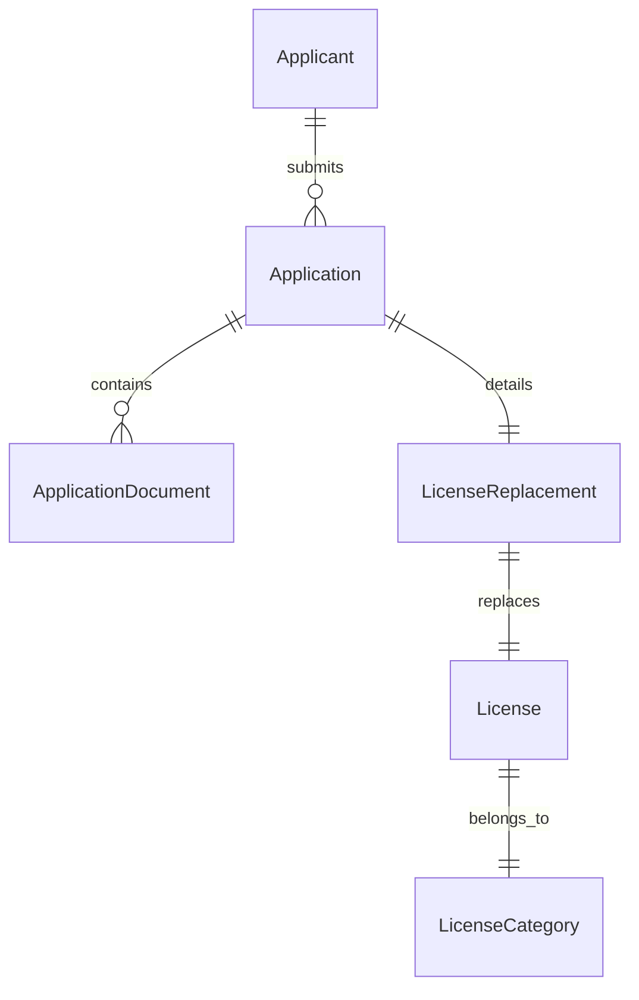

# Data Model: License Replacement

## New/Modified Entities

### 1. LicenseReplacement (Modified)
Extends the existing entity to include structured reasons and review status.

| Field | Type | Description |
| :--- | :--- | :--- |
| **ReplacementReason** | `Enum` | Lost, Damaged, Stolen |
| **IsReportVerified** | `bool` | True if the Receptionist has approved the Police Report |
| **ReviewComments** | `string?` | Internal notes from the reviewer |

### 2. License (Modified)
No schema changes required, but we define a new status behavior.

- **Status**: Transition to `Replaced` (Enum: `LicenseStatus`) when a replacement is issued.

## New Enums

### ReplacementReason
- `Lost` (1)
- `Damaged` (2)
- `Stolen` (3)

### ServiceType (Existing Extension)
- `Replacement` (value to be added if missing)

## Database Relationships

## Seed Data & Configuration
- **SystemSettings**: No new keys (use existing application expiry rules).
- **FeeStructures**:
    - `ServiceType`: Replacement
    - `Amount`: [Flat Rate]
    - `Category`: [NULL/Default]
