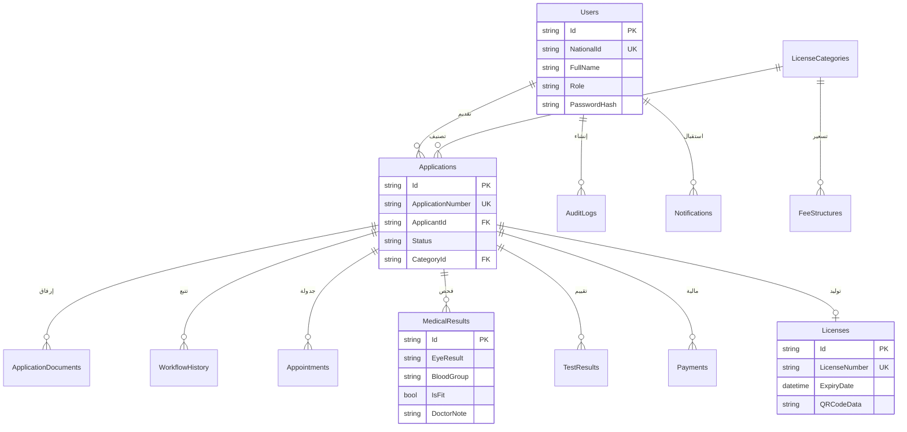
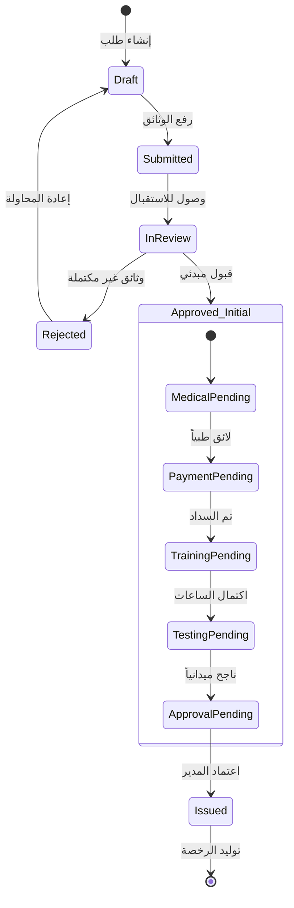
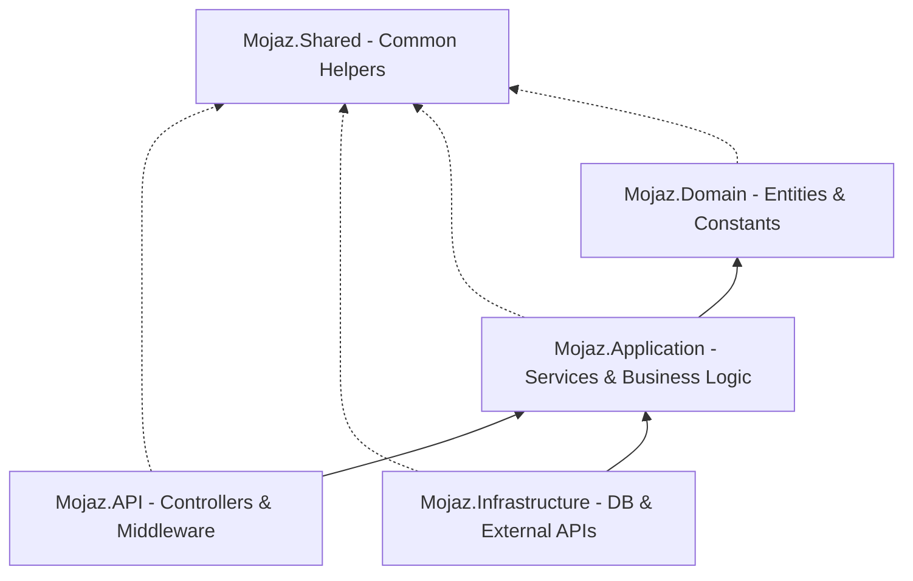

# مجموعة المخططات الرسمية المحدثة (الإصدار الثالث) - نظام "مجاز"

هذه المخططات مصممة لتعكس التعقيد الحقيقي لنظام "مجاز" وهي الأنسب لوضعها في فصل "تصميم النظام" (Chapter 3 & 4).

---

## 1. مخطط حالات الاستخدام التفصيلي (Extended Use Case Diagram)
*يوضح بدقة مسؤوليات كل طرف في منظومة المرور الرقمية.*

```mermaid
useCaseDiagram
    actor "المتقدم (Applicant)" as App
    actor "موظف الاستقبال (Receptionist)" as Rec
    actor "الطبيب (Doctor)" as Doc
    actor "الفاحص التجريبي (Examiner)" as Exa
    actor "المدير (Manager/Security)" as Mgr
    actor "المشرف (Admin)" as Adm

    package "بوابة الخدمة الذاتية" {
        usecase "إدارة الحساب والمؤشرات" as UC_Profile
        usecase "تقديم طلب (8 خدمات مرورية)" as UC_Apply
        usecase "رفع الوثائق الرقمية" as UC_Upload
        usecase "حجز المواعيد الآلي" as UC_Apps
        usecase "السداد الإلكتروني" as UC_Pay
        usecase "عرض الرخصة الرقمية" as UC_View
    }

    package "العمليات الداخلية" {
        usecase "تدقيق وتحقق وثائق" as UC_Audit
        usecase "رصد اللياقة الطبية" as UC_Med
        usecase "تقييم ساعات التدريب" as UC_Train
        usecase "رصد نتائج الاختبار" as UC_Test
        usecase "الاعتماد المباشر للرخصة" as UC_Approve
    }

    package "الإدارة والرقابة" {
        usecase "إدارة المستخدمين" as UC_Users
        usecase "تغيير ثوابت النظام والرسوم" as UC_Config
        usecase "التحقق الميداني (QR Scan)" as UC_Scan
    }

    App --> UC_Profile
    App --> UC_Apply
    App --> UC_Upload
    App --> UC_Apps
    App --> UC_Pay
    App --> UC_View

    Rec --> UC_Audit
    Doc --> UC_Med
    Exa --> UC_Test
    Exa --> UC_Train
    Mgr --> UC_Approve
    Mgr --> UC_Scan

    Adm --> UC_Users
    Adm --> UC_Config
```

---

## 2. مخطط علاقات الكيانات (ERD - Database Schema)
*يوضح الهيكلية البرمجية المطبقة في قاعدة بيانات SQL Server.*



---

## 3. مخطط حالة الطلب (State Machine Diagram)
*يوضح منطق الانتقال البرمجي المعقد داخل ApplicationWorkflowService.*



---

## 4. مخطط طبقات المعمارية (Clean Architecture Layers)
*يوضح كيفية تنظيم الكود المصدري للمشروع.*


