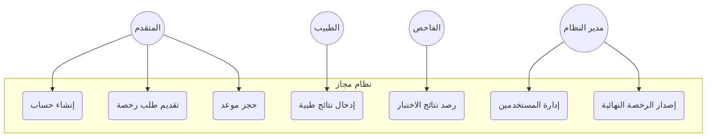
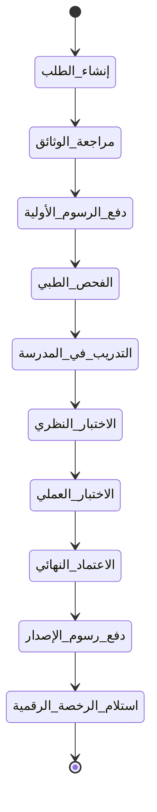

# الفصل الثالث: تحليل ونمذجة المتطلبات (Requirements Analysis & Modeling)

## 3.1 مقدمة (Introduction)
يمثل هذا الفصل حجر الزاوية في بناء المنصة، حيث يتم فيه تفكيك احتياجات أصحاب المصلحة وتحويلها إلى متطلبات تقنية وأشكال نـمذجة قابلة للتنفيذ. لقد استندنا في هذه المرحلة إلى المرجع الدراسي (مشروع رخص البناء) لضمان تقديم تحليل أكاديمي احترافي يشمل دراسات الجدوى والنمذجة الرسومية المتكاملة.

## 3.2 متطلبات النظام (System Requirements)

### 3.2.1 المتطلبات الوظيفية (Functional Requirements)
تم حصر الوظائف الأساسية وتوزيعها على الأدوار السبعة (7 Roles) كما يلي:

1.  **المتقدم (Applicant)**:
    -   إنشاء ملف تعريف وطني والتسجيل برقم الهاتف.
    -   طلب إصدار رخصة جديدة أو تجديد رخصة منتهية.
    -   رفع الوثائق الرقمية (صور الهوية، السندات، الخ).
    -   حجز مواعيد الفحص الطبي والاختبارات النظري والعملي.
2.  **الطبيب (Doctor)**:
    -   الوصول إلى قوائم المتقدمين المحالين للفحص الطبي.
    -   تسجيل نتائج قياس النظر، فصيلة الدم، واللياقة البدنية.
    -   رفع التقرير الطبي بصيغة إلكترونية غير قابلة للتعديل.
3.  **الفاحص (Examiner)**:
    -   رصد حضور المتقدمين لميدان الاختبار.
    -   رصد المحاولات (3 محاولات كحد أقصى) وإدخال النتائج (ناجح/راسب).
4.  **المشرف/المدير (Manager/Supervisor)**:
    -   متابعة مؤشرات الأداء (KPIs).
    -   اعتماد الإصدار النهائي بعد استيفاء كافة الشروط.
    -   إدارة استثناءات النظام.

### 3.2.2 المتطلبات غير الوظيفية (Non-Functional Requirements)
-   **التوافر (Availability)**: استدامة الخدمة بنسبة 99.9% لضمان وصول المواطنين في أي وقت.
-   **سرعة الاستجابة (Performance)**: وقت استجابة الـ API لا يتجاوز 1.5 ثانية في العمليات الاعتيادية.
-   **التوافق البرمجي (Interoperability)**: دعم كافة المتصفحات الحديثة (Chrome, Safari, Firefox).
-   **دوران البيانات (Scalability)**: القدرة على التعامل مع تنامي قاعدة البيانات (من مئات إلى ملايين السجلات).

## 3.3 منهجية المشروع (Project Methodology)
تم اتباع منهجية **Scrum** (إحدى تفرعات Agile) حيث تم تقسيم العمل إلى 10 تكرارات برمجية (Sprints)، كل تكرار يركز على خدمة معينة أو فئة رخص محددة، مما ساعد في اكتشاف الأخطاء ومعالجتها مبكراً.

## 3.4 دراسة الجدوى (Feasibility Study)

### 3.4.1 الجدوى التقنية (Technical Feasibility)
أظهرت الدراسة كفاءة بيئة العمل (Next.js 15 & .NET 8) في التعامل مع متطلبات النظم الحكومية، مع توفر دعم كامل للغة العربية وتكامل سلس مع خدمات الـ Cloud للإشعارات.

### 3.4.2 الجدوى الاقتصادية (Financial Feasibility)
يساهم النظام في توفير ما يقارب 60% من التكاليف التشغيلية السنوية التي كانت تُصرف على الأدوات المكتبية والتخزين المادي، ناهيك عن العائد المادي من تسريع تحصيل رسوم التراخيص.

### 3.4.3 الجدوى التشغيلية (Operational Feasibility)
تبين أن النظام يقلل من حاجة المواطن للزيارة الميدانية من 5 زيارات في النظام القديم إلى زيارة واحدة فقط (للاختبار)، مما يقلل الضغط على موظفي المرور.

## 3.5 الفوائد الملموسة وغير الملموسة (Project Benefits)
-   **الملموسة**: تقليل وقت إصدار الرخصة من أسابيع إلى أيام معدودة، وضمان صحة البيانات بنسبة 100%.
-   **غير الملموسة**: تعزيز مفهوم "المواطنة الرقمية" وزيادة الرضا العام عن الخدمات الحكومية.

## 3.6 لغة النمذجة الموحدة (UML Modeling)

### 3.6.1 مخطط حالة الاستخدام (Use Case Diagram)
يوضح هذا المخطط تداخل الأدوار المختلفة في النظام:

### 3.6.2 مخطط النشاط (Activity Diagram)
يصف المسار الطويل لطلب الرخصة (10 مراحل):

### 3.6.3 مخطط تدفق البيانات (DFD - Level 1)
يوضح حركة البيانات بين العمليات والمخازن:
-   **البيانات الواردة**: بيانات الهوية، نتائج الفحوصات، إيصالات الدفع.
-   **البيانات الصادرة**: رقم الرخصة الرقمي، إشعارات الـ SMS، تقارير الأداء.

## 3.7 نموذج قاعدة البيانات (ERD)
تشمل قاعدة البيانات 24 جدولاً، مرتبطة بعلاقات (One-to-Many) و (Many-to-Many).
*(ملاحظة: سيتم إرفاق صورة الـ ERD التفصيلية المولدة من SQL Server في الملحقات).*

## 3.8 قاموس البيانات (Data Dictionary)
أمثلة من القاموس البرمجي:
-   **جدول (Applications)**: مفتاح أساسي تلقائي، رقم طلب فريد (MOJ-YYYY-XXXX)، حالة الطلب (Enum)، فئة الرخصة (FK).
-   **جدول (Licenses)**: رقم الرخصة، تاريخ الإصدار، تاريخ الانتهاء، مصفوفة الصلاحيات.
