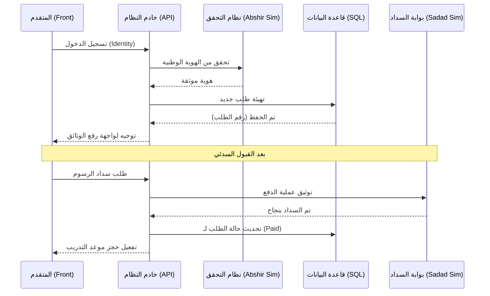

# بحث مشروع تخرج منصة "مجاز" (Mojaz) - النسخة النهائية الموحدة

هذا المستند يمثل النسخة الاحترافية الكاملة الموحدة، والمحدثة بكافة المخططات والشروحات التفصيلية. يمكنك نسخ محتوى كل فصل ووضعه في ملف `بحث التخرج.docx` الخاص بك.

---

## الفصل الأول: الإطار العام للمشروع

### 1.1 مقدمة
يمثل التحول الرقمي حجر الزاوية في تطوير الخدمات الحكومية، حيث تهدف منصة "مجاز" إلى إعادة ابتكار تجربة الحصول على رخص القيادة من خلال نظام إلكتروني متكامل يربط كافة الجهات الفاعلة (المواطن، الصحة، مدرسة القيادة، المرور) في بيئة سحابية واحدة.

### 1.2 مشكلة البحث
1.  بطء الإجراءات التقليدية والحاجة للزيارات المتكررة.
2.  صعوبة التحقق من صحة الوثائق الفنية (الطبية، التدريبية) ورقياً.
3.  مركزية البيانات وصعوبة الوصول إليها لحظياً لرجال الأمن.

### 1.3 أهداف المشروع
- بناء بنية تحتية رقمية قوية وآمنة لإدارة المعاملات المرورية.
- تحقيق الربط الرقمي بين المراكز الطبية وإدارات المرور.
- تقديم رخصة رقمية ذكية مزودة بـ QR Code للتحقق الفوري.

---

## الفصل الثاني: التحليل الفني ودراسة الجدوى

### 2.1 دراسة الجدوى التقنية
اعتماد معمارية **Clean Architecture** باستخدام **ASP.NET Core 8** و **Next.js 15** لضمان قابلية التوسع والأمان العالي، ولتحمل ضغط الطلبات المتزايدة.

### 2.2 القواعد الحاكمة (Business Rules)
النظام مبرمج للتحقق تلقائياً من القواعد التالية:
- السن القانوني (16، 18، 21 سنة حسب فئة الرخصة).
- صلاحية الفحص الطبي (90 يوماً).
- اجتياز ساعات التدريب المقررة.

---

## الفصل الثالث: نمذجة النظام (المخططات المحدثة)

### 3.1 مخطط حالات الاستخدام (Use Case Diagram)
يوضح هذا المخطط العمليات الأساسية لكل نوع من المستخدمين:

```mermaid
useCaseDiagram
    actor "المتقدم (Applicant)" as App
    actor "الطبيب (Doctor)" as Doc
    actor "الفاحص (Examiner)" as Exa
    actor "المدقق (Receptionist)" as Rec
    actor "مدير النظام (Admin)" as Adm

    package "منصة مجاز" {
        usecase "إنشاء طلب رخصة" as UC1
        usecase "حجز موعد" as UC2
        usecase "رصد نتيجة طبية" as UC3
        usecase "رصد نتيجة اختبار" as UC4
        usecase "تدقيق البيانات" as UC5
        usecase "توليد الرخصة الرقمية" as UC6
        usecase "إدارة الإعدادات والرسوم" as UC7
    }

    App --> UC1
    App --> UC2
    Doc --> UC3
    Exa --> UC4
    Rec --> UC5
    Rec --> UC6
    Adm --> UC7
```

### 3.2 مخطط النشاط (Activity Diagram) - دورة حياة الطلب (10 مراحل)
يصف التسلسل الإجرائي للطلبات:

```mermaid
activityDiagram
    start
    :تقديم الطلب ورفع الوثائق;
    :تدقيق البيانات (الاستقبال);
    if (البيانات صحيحة؟) then (نعم)
        :الفحص الطبي (المستشفى);
        if (لائق طبياً؟) then (نعم)
            :سداد الرسوم الحكومية;
            :التدريب (المدرسة);
            :الاختبار النظري;
            :الاختبار العملي (الميداني);
            if (ناجح؟) then (نعم)
                :الاعتماد النهائي للرئيس;
                :توليد الرخصة الرقمية;
                stop
            else (لا)
                :إعادة الاختبار;
                detach
            endif
        else (لا)
            :رفض الطلب لعدم اللياقة;
            stop
        endif
    else (لا)
        :طلب تعديل الوثائق;
        stop
    endif
```

### 3.3 مخطط التتابع (Sequence Diagram) - عملية إصدار رخصة
يوضح التفاعل بين المكونات البرمجية والجهات الخارجية:



---

## الفصل الرابع: واجهات النظام (شرح مفصل)

*(ملاحظة: يمكنك نقل النصوص التفصيلية من ملف Mojaz_Research_Screens_Final_Explanations.md إلى هذا الجزء لتكملة الشرح المكتمل لكل الـ 23 واجهة).*

**أبرز الواجهات:**
- **البوابة العامة**: واجهة هبوط عصرية تدعم الـ RTL بشكل كامل.
- **لوحة المتقدم**: تحتوي على "مخطط سري الطلب" (Workflow Stepper) لمتابعة المراحل.
- **واجهة الموظف**: قوائم انتظار ذكية ترتب الطلبات حسب الأولوية.

---

## الفصل الخامس: التنفيذ والاختبار

### 5.1 معمارية البرمجيات
تم تقسيم النظام إلى أربعة طبقات أساسية لضمان "نظافة الكود":
1.  **Domain**: تحتوي على الكيانات والقواعد الأساسية.
2.  **Application**: تحتوي على منطق العمل (Use Cases).
3.  **Infrastructure**: لإدارة قواعد البيانات والاتصال بالخدمات الخارجية.
4.  **API**: الواجهة التي تتخاطب معها صفحة الويب.

### 5.2 جدول حالات الاختبار (Verification Results)
| رقم الاختبار | الوصف | المدخلات | النتيجة |
| :--- | :--- | :--- | :--- |
| **TC1** | التحقق من السن | عمر < 18 | منع تقديم طلب (خصوصي) |
| **TC2** | سداد الرسوم | حالة Payment | تفعيل مرحلة التدريب آلياً |
| **TC3** | أمان QR | مسح الكود | إظهار بيانات الرخصة الحقيقية |

---

## الفصل السادس: الخاتمة والتوصيات

### 6.1 الخاتمة
نجح مشروع "مجاز" في تقديم نموذج عملي لرقمنة الخدمات الحكومية، حيث أثبتت التجربة أن استخدام تقنيات الـ Web الحديثة يمكن أن يحل مشاكل البيروقراطية التاريخية.

### 6.2 التوصيات
- توسيع النظام ليشمل خدمات "تجديد لوحات المركبات" و "نقل الملكية".
- تفعيل خاصية "التفتيش الميداني" عبر تطبيق ذكي لرجال المرور.
- الربط مع نظام "السجل المدني" للتحقق التلقائي من الهوية.

---

## المراجع
1.  قانون المرور اليمني - وزارة الداخلية.
2.  Architecture Patterns in ASP.NET Core - Microsoft.
3.  Clean Architecture - Robert C. Martin.
4.  Next.js Documentation - Vercel.
5.  وثائق نظام "أبشر" (دراسة حالة).
